<p align="center">
  
</p>

<p align="center">
  <a href="https://linkedin.com/in/vaibhavbhagat5">LinkedIn</a>
  &nbsp;&nbsp;&nbsp;&nbsp;
  <a href="mailto:vaibhavbhagat7461@gmail.com">Email</a>
  &nbsp;&nbsp;&nbsp;&nbsp;
  <a href="https://pypi.org/project/sentinel-sec/">sentinel-sec on PyPI</a>
</p>

## About

```yaml
# model_card.yaml
name: Vaibhav Bhagat
architecture: B.Tech, Information Technology
institution: IIIT Sonepat
training_ends: 2028
pretrained_on: [Python, C++, Go, TypeScript, Java, Dart]
fine_tuned_for:
  - transformers and retrieval-augmented generation
  - LLM agents that do real work
  - full-stack apps for web and mobile
ask_me_about: [RAG pipelines, Raft consensus, Dockerizing a Next.js app]
open_to: [internships, research collaborations, open source]
```

## Projects

An agent, a product, and a piece of infrastructure.

**[sentinel-sec](https://github.com/VaibhavBhagat665/sentinel-sec)**<br>
A security agent that finds vulnerabilities in Python and JavaScript code, fixes them, then checks the fix with Bandit and Semgrep. Runs offline on Ollama or fast on Groq. Install it with `pip install sentinel-sec`.<br>
<sub>`Python` `Llama 3` `Bandit` `Semgrep`</sub>

**[nextalk](https://github.com/VaibhavBhagat665/nextalk)**<br>
Real-time team chat with AI summaries and action items, file sharing, and voice and video calls. Web and mobile clients.<br>
<sub>`Next.js` `TypeScript` `Prisma` `WebSockets` `Docker` `Groq`</sub>

**[DistributedKV](https://github.com/VaibhavBhagat665/Distributed-In-Memory-KV-Store)**<br>
A distributed in-memory key-value store with Raft consensus and persistence. A C++ storage engine sits under a Go coordination layer.<br>
<sub>`C++17` `Go` `Raft`</sub>

## Stack

**Languages**<br>


**AI and ML**<br>
<br>
<sub>also Keras, LangChain, Streamlit, Groq, Ollama</sub>

**Web and mobile**<br>


**Shipping**<br>


## Metrics

<p align="center">
  
  
</p>

<p align="center">
  <sub>Training is still running. Check back for updates.</sub>
</p>
